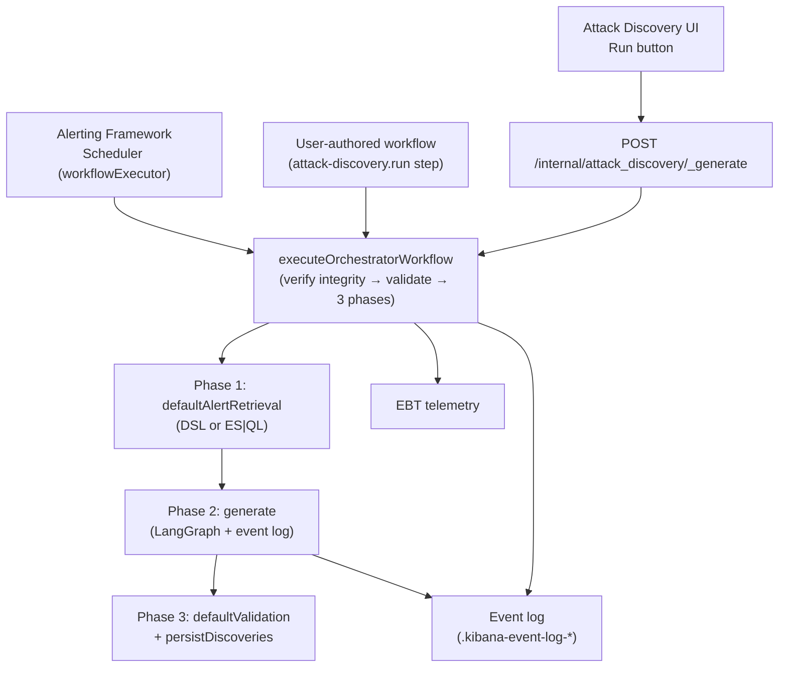
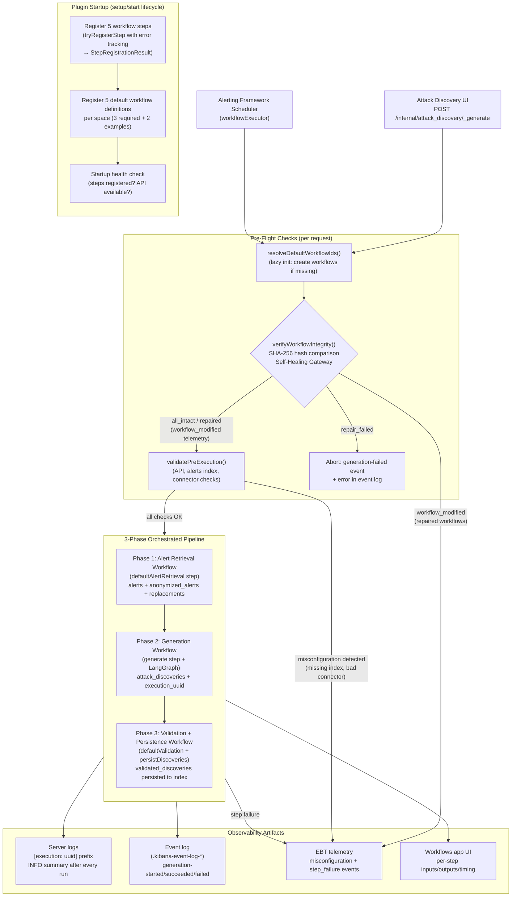
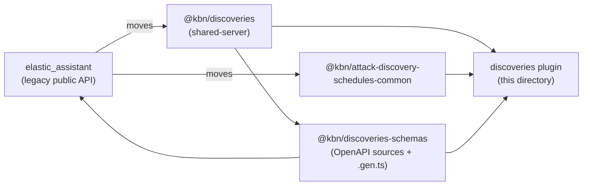
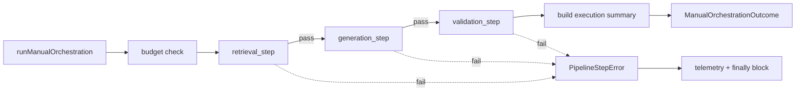
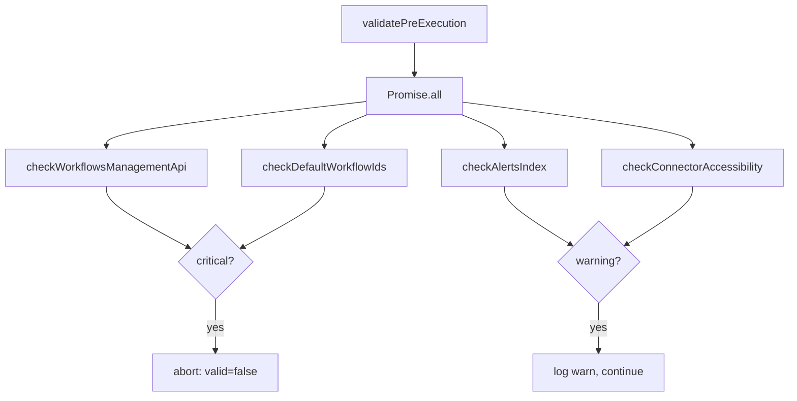
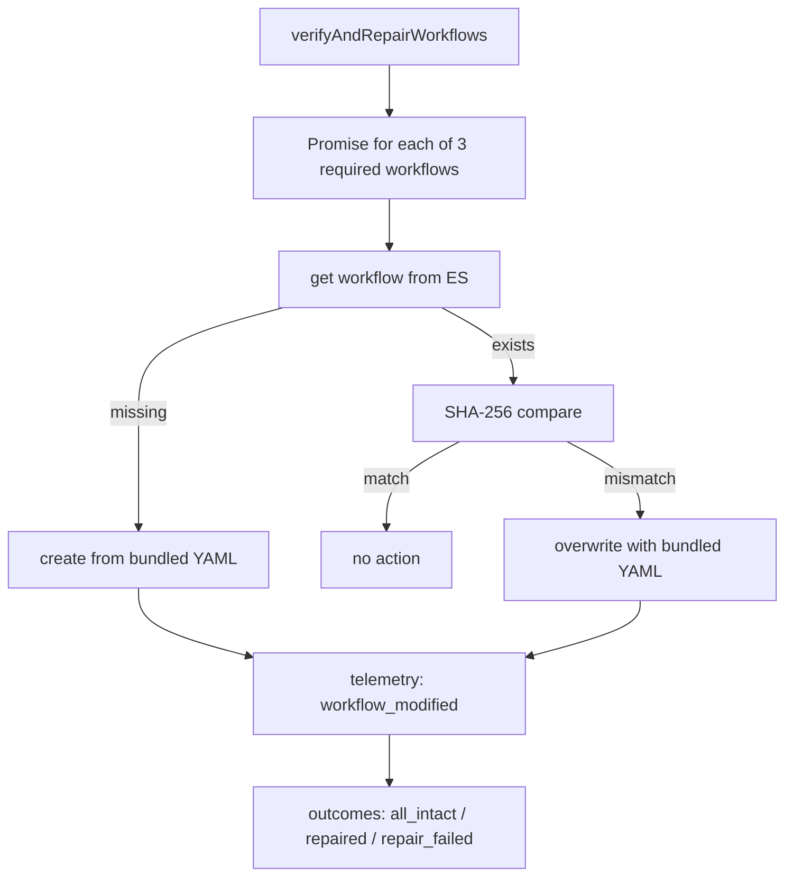
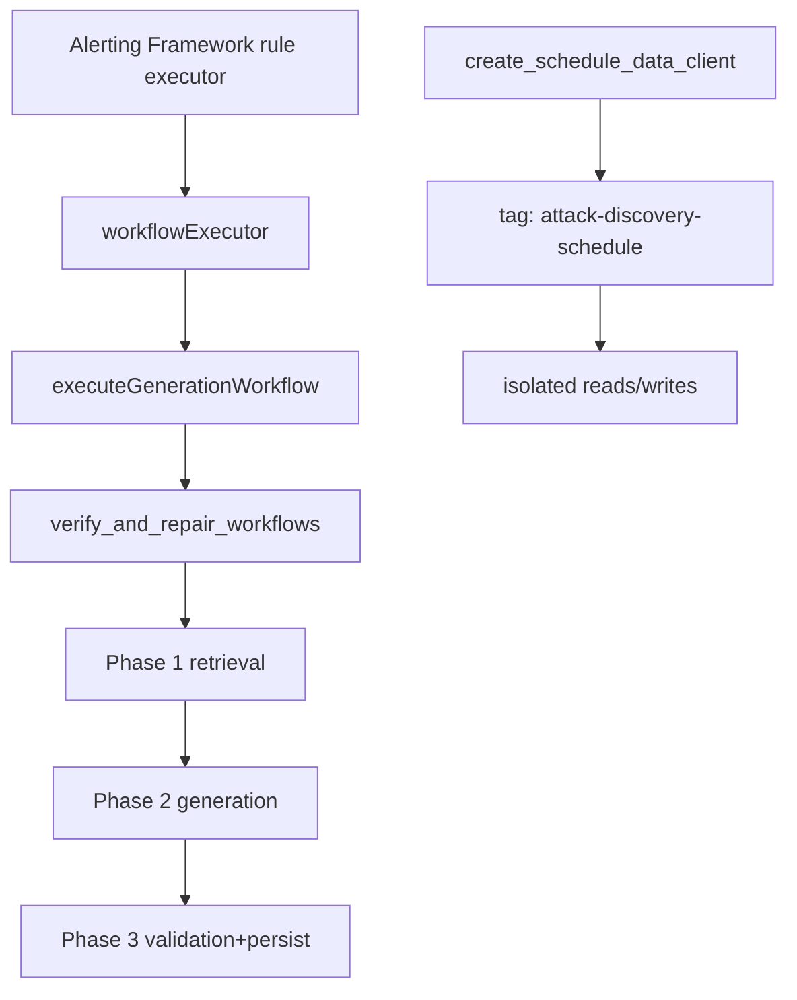
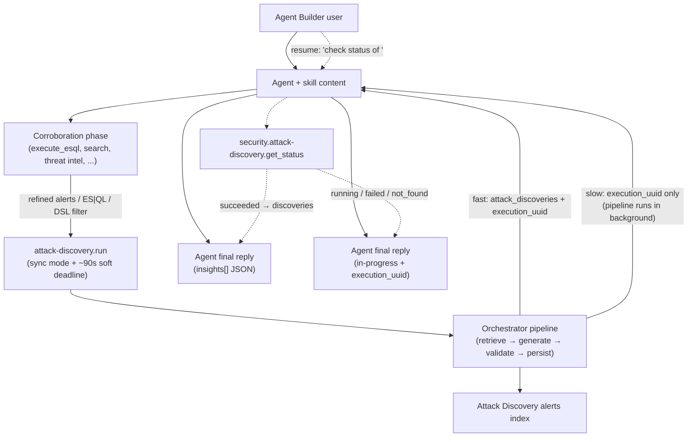

# Discoveries Plugin

Through an integration with Kibana Workflows, Attack Discovery 2.0 decouples the generation pipeline from the monolithic `elastic_assistant` endpoint and runs each phase (alert retrieval → generation → validation → persistence) as a Kibana Workflows step. The Alerting Framework still owns scheduling, alert persistence, and action execution (with full throttling/frequency support); the Workflows engine owns only the generation pipeline.

This plugin lets users:

- Optimize the alerts context provided to Attack Discovery via user-defined workflows and agents
- Post-process generations via workflows and agents to enrich, validate, and reject generations before they are promoted to attacks

This README is the architecture reference for AD 2.0. Sections are organized top-down from feature flag to ADR appendix; the **Architecture (build narrative)** section walks through how each PR in the 10-PR stack contributed to the final system.

## Status & Feature Flag

The whole feature is gated behind `securitySolution.attackDiscoveryWorkflowsEnabled` (default **OFF**). With the flag OFF every PR preserves existing behavior exactly — the public `elastic_assistant` API surface is unchanged, no new routes accept requests, no workflow steps register, and no integrity verification or pre-execution validation runs.

### Enable in `kibana.dev.yml`

```yaml
feature_flags.overrides:
  securitySolution.attackDiscoveryWorkflowsEnabled: true
```

## Decoupling alert retrieval, generation, and promotion

The current implementation of Attack discovery generation is implemented as a singluar `/api/attack_discovery/_generate` public API [route](https://www.elastic.co/docs/api/doc/kibana/operation/operation-postattackdiscoverygenerate) that encapsulates both the retrieval of anonymized alerts before generation, and writing Attack discoveries to an alerts index after generation.

Additional APIs enable scheduling Attack discovery generations, which are also written to an attack discoveries index by the alerting framework, and provided as context to actions that are run within the alerting framework.

The Attack discovery 2.0 architecture decouples alert retrieval, generation, and promotion into workflow steps, with out-of-the-box defaults, that users can augment or replace with custom workflows.


## Overview

### Three execution paths

- **Internal APIs** for generating and validating security insights
- **Workflow Steps** for alert retrieval, generation, and validation

### Three Ways to Run Attack Discovery

Users may run Attack discovery via:

1. Schedules (Alerting Framework Scheduler)
2. User-authored workflows (attack-disocvery-run step)
3. Kibana (Ad hoc)




## Packages and Plugins

```
┌────────────────────────────────────────────────────────────────────┐
│  @kbn/discoveries Package (server-only)                            │
│  - LangGraph execution logic (graphs, orchestration)               │
│  - Event logging utilities (shared with elastic_assistant)         │
│  - Hallucination detection, anonymization, schedule transforms     │
│  - Telemetry event definitions (EBT)                               │
└────────────────────────────────────────────────────────────────────┘
┌────────────────────────────────────────────────────────────────────┐
│  @kbn/discoveries-schemas Package (shared-common)                  │
│  - OpenAPI schemas (.schema.yaml)                                  │
│  - Generated TypeScript types and Zod validators (.gen.ts)         │
└────────────────────────────────────────────────────────────────────┘
                               │
                               ▼
┌──────────────────────────────────────────────────────────────────────┐
│  discoveries Plugin                                                  │
│  ┌────────────────────────────────────────────────────────────────┐  │
│  │  Internal APIs:                                                │  │
│  │  - POST /internal/attack_discovery/_generate                   │  │
│  │  - POST /internal/attack_discovery/_validate                   │  │
│  │  - Schedule CRUD (create/find/get/update/delete/enable/disable)│  │
│  └────────────────────────────────────────────────────────────────┘  │
│  ┌────────────────────────────────────────────────────────────────┐  │
│  │  Workflow Steps:                                               │  │
│  │  - attack-discovery.defaultAlertRetrieval                      │  │
│  │  - attack-discovery.generate (with event logging)              │  │
│  │  - attack-discovery.defaultValidation                          │  │
│  │  - attack-discovery.persistDiscoveries                         │  │
│  │  - attack-discovery.run (full pipeline in one step)            │  │
│  └────────────────────────────────────────────────────────────────┘  │
└──────────────────────────────────────────────────────────────────────┘
```

### Execution Flow



### Schedulding Architecture

The native scheduling features of Workflows will eventually replace the Attack discovery [create schedule](https://www.elastic.co/docs/api/doc/kibana/operation/operation-createattackdiscoveryschedules) public API. (The alerting actions will be executed by a workflow.)

- Scheduling is always alerting-backed regardless of the feature flag state.

- The Alerting Framework owns scheduling, alert persistence, and action execution (with full throttling/frequency support).

- The Workflows engine owns only the generation pipeline (alert retrieval → generation → validation). This unified model ensures action frequency settings are always enforced.


## Architecture (build narrative)

This section describes how the system was assembled. Each subsection corresponds to one PR in the 10-PR stack; conceptual headings keep the doc readable as product reference after the stack ships.

### Shared package extraction *(landed in PR 1)*

PR 1 was a pure structural refactor. It extracted shared server-side logic out of `elastic_assistant` into three new packages so both `elastic_assistant` and the upcoming `discoveries` plugin can consume the same code without duplication:

- **`@kbn/discoveries`** (`shared-server`) — LangGraph generation pipeline, event-log writer, hallucination detection, anonymization helpers, telemetry event definitions, traced logger. Cannot be imported by browser code.
- **`@kbn/discoveries-schemas`** (`shared-common`) — OpenAPI source schemas (`*.schema.yaml`) and their generated TS types/Zod validators (`*.gen.ts`). Used for REST route validation; `@kbn/zod` v3 (deliberate — see PR 2 for the v4-only step schema rule).
- **`@kbn/attack-discovery-schedules-common`** — schedule data client, transforms (API ↔ internal), field map, alert-update helpers.



PR 1 introduced no behavior change with FF OFF. Every moved file kept the existing public `elastic_assistant` API surface working; re-exports / shim wiring in `elastic_assistant/server/...` resolve to the moved targets.

### Plugin scaffold and step registration *(landed in PR 2)*

PR 2 added the `discoveries` plugin scaffold and registered the five workflow step definitions with `@kbn/workflows-extensions`. Each step is a `CommonStepDefinition<TInput, TOutput>` whose schemas are defined inline with `@kbn/zod/v4` — this is a platform requirement of the Workflows engine. v3 schemas (used for REST route validation) MUST NEVER be cast to v4 for workflow steps; v4 enums carry a `.values` property that v3 lacks, so a runtime cast surfaces as `TypeError: Cannot read properties of undefined (reading 'values')` in the Workflows UI.

The five step IDs are:

- `attack-discovery.defaultAlertRetrieval`
- `attack-discovery.generate` (emits per-phase events to the event log)
- `attack-discovery.defaultValidation`
- `attack-discovery.persistDiscoveries`
- `attack-discovery.run`

Common step definitions live in [`common/step_types/`](common/step_types/); server handlers wrapping them with `createServerStepDefinition` live in [`server/workflows/steps/`](server/workflows/steps/).

### Internal API + ES|QL alert retrieval *(landed in PR 3)*

PR 3 added the internal HTTP routes that surface the orchestrated pipeline:

| Route | Purpose | RBAC |
|-------|---------|------|
| `POST /internal/attack_discovery/_generate` | Kicks off async generation, returns `execution_uuid` | Existing AD privileges; FF gate via `assertWorkflowsEnabled` |
| `POST /internal/attack_discovery/_validate` | Validates and persists pre-generated discoveries | Same as above |
| `POST /internal/attack_discovery/schedules` and friends | Schedule CRUD (create / find / get / update / delete / enable / disable) | Same as above; tag-based isolation enforced by data client |
| `GET /internal/attack_discovery/_pipeline_data/:executionUuid` | Real-time per-step inputs/outputs/timing for the UI | Per-user; relies on Workflows app authz |

All routes use **`asCurrentUser` only** — never `asInternalUser`. Privilege escalation is impossible because every ES query inherits the authenticated request's permissions.

PR 3 also introduced the ES|QL alert retrieval mode: an alternative to DSL-based retrieval that lets users author retrieval workflows with arbitrary ES|QL queries.

### Orchestration, event logging, pre-execution validation *(landed in PR 4)*

PR 4 replaced the monolithic generation endpoint with a 3-phase orchestrated pipeline. The orchestrator chains the three phases with timeout budgets and decrements the remaining budget before invoking each phase.



Pre-execution validation runs four checks concurrently (`Promise.all`) before the pipeline starts:



Critical issues (WorkflowsManagement API unavailable, default workflow IDs unresolvable) abort the pipeline. Warnings (alerts index missing, connector unreachable) are logged but execution proceeds — and they emit `attack_discovery_misconfiguration` EBT events for fleet-wide visibility.

PR 4 also wired up the per-phase event-log integration (`generation-started/succeeded/failed`, `alert-retrieval-*`, `validation-*`) and the traced logger that prefixes every server log message with `[execution: {uuid}]`.

### EBT telemetry contract *(landed in PR 5)*

PR 5 added three new EBT events and augmented the shared `attack_discovery_success/error` events (registered by `elastic_assistant`) with workflow-specific fields. The full contract is documented in the [telemetry README](../../packages/kbn-discoveries/impl/lib/telemetry/README.md). Key constraints:

- **Privacy** — no event field carries query content, alert content, alert rule names, user-defined workflow names, user identifiers, or connector credentials. Only enums, counts, durations, and IDs.
- **Field naming** — new fields are `snake_case`. Pre-existing camelCase fields on shared events are retained as-is to avoid breaking the schema.
- **FF-off backwards compat** — every augmented field is `optional: true`; legacy events that omit them still validate.

### Workflow configuration UI *(landed in PR 6)*

PR 6 added workflow configuration to the Attack Discovery settings flyout: alert retrieval mode (DSL / ES|QL / custom workflow), custom workflow picker with async existence + enabled validation, "Edit with AI" (Agent Builder integration), validation panel, and full schedule management (create / details / table). When FF is OFF the settings flyout renders the existing experience unchanged.

It opens Agent Builder with the user's current ES|QL query as an attachment — query template/text only, no alert content, no sample results, no user-defined workflow names.

### Execution monitoring + details flyout *(landed in PR 7)*

PR 7 added real-time execution monitoring to the Attack Discovery UI: live progress timer in the loading callout, pipeline data cards (alert / discovery / dropped / filtered / persisted counts), execution details flyout with per-step inspection, step data modal (serialized I/O), failure classification, and "Troubleshoot with AI" integration. When FF is OFF the loading callout renders the legacy experience unchanged.

The **step data modal** renders raw per-step I/O. This surface is intentionally analyst-facing — the route serving the data enforces RBAC, and the UI never shows step data to users without the appropriate Attack Discovery privilege.

### Agent Builder skills *(landed in PR 8)*

PR 8 registered three Agent Builder skills, all gated by the FF:

- **`alert-retrieval-builder`** — the server side of "Edit with AI"; turns natural-language descriptions into ES|QL retrieval workflows.
- **`workflow-troubleshooting`** — the server side of "Troubleshoot with AI"; consumes a diagnostic report and explains failure modes.
- **`attack-discovery-generator`** — analyst skill that gathers and corroborates evidence with whatever tools are available (threat hunting, threat intelligence, entity context, knowledge base) and then delegates the canonical generation pipeline to `attack-discovery.run` (sync mode with a ~90s soft deadline, per ADR-012) so anonymization, hallucination detection, validation, and persistence remain inside the audited pipeline. Also exposes a status-only mode that resumes a prior generation by `execution_uuid` via `security.attack-discovery.get_status`. Reuses the analyst prompt constants from [`attack_discovery_prompts.ts`](server/lib/prompt/local_prompt_object/attack_discovery_prompts.ts) for the JSON schema field descriptions, MITRE tactic list, and field-syntax block.

All three skills sanitize their inputs at the LLM boundary: no PII, no secrets, no user identifiers in prompts or attachments.

### Self-healing workflow integrity verification *(landed in PR 9)*

PR 9 added pre-execution integrity verification for the three required default workflows (alert retrieval, generation, validation). Before each generation run, the system fetches each workflow from Elasticsearch, computes a SHA-256 hash of the stored YAML, and compares it against the bundled YAML hash.



| Outcome | Meaning | Pipeline |
|---------|---------|----------|
| `all_intact` | All 3 workflows match bundled definitions | Continues |
| `repaired` | One or more workflows were restored; `workflow_modified` telemetry emitted | Continues |
| `repair_failed` | One or more workflows could not be restored | **Aborted** — `generation-failed` event written with error reason |

Cache invalidation is correct: `initializedSpaces` is keyed by `spaceId`, and only the affected space's entry is invalidated when a missing-workflow re-creation occurs.

### Schedule integration with the Alerting Framework *(landed in PR 10)*

PR 10 connected the workflow-based generation pipeline to the Alerting Framework scheduler, completing the hybrid scheduling architecture.



Bidirectional **tag-based isolation** is enforced at the schedule data client: the internal API tags every schedule with `attack-discovery-schedule` and filters reads to that tag; the public API applies no tags.

| Caller | Sees | Cannot see |
|--------|------|------------|
| Public API user (legacy) | Schedules created via the public API | Workflow-tagged schedules |
| Internal API user (workflows on) | Workflow-tagged schedules | Public/legacy schedules |

The Alerting Framework retains ownership of scheduling, alert persistence, and action execution — so action throttling and frequency settings keep working unchanged. The Workflows engine owns only the generation pipeline.

## Anonymization Boundary

```mermaid
flowchart LR
  ES["Elasticsearch<br/>raw alerts"] --> RET["defaultAlertRetrieval<br/>step"]
  RET -->|anonymized string[]| GEN["generate step<br/>(LangGraph)"]
  RET -->|replacements map| RM[(replacements<br/>map)]
  GEN --> VAL["defaultValidation"]
  VAL --> PER["persistDiscoveries"]
  RM -.->|de-anonymize<br/>on display only| UI["Attack Discovery UI"]
  GEN -.->|excluded| RUN["attack-discovery.run<br/>output"]
```

The anonymization boundary sits at the **alert retrieval** step. Everything upstream (raw Elasticsearch alerts) is real data; everything downstream operates on anonymized strings. The `replacements` map is the only bridge between the two worlds — and it is **deliberately excluded by the output schema** of `attack-discovery.run` so user-authored workflows cannot inadvertently log or forward the de-anonymization key to external systems.

The `generate` step's input contract is `alerts: string[]` (anonymized strings), not structured alert objects — making it impossible to accidentally pass raw alert objects to the LLM.

The `defaultAlertRetrieval` step ensures the `_id` field is always present in the anonymization configuration. Downstream steps use real alert IDs for hallucination detection — IDs are allowed but not anonymized.

## Modes of Execution

Attack Discovery can be triggered in three ways. All three converge on `executeOrchestratorWorkflow` and share the same step pipeline.

### 1. Ad Hoc (Interactive UI)

The user clicks **Run** in the Attack Discovery UI. The `useAttackDiscovery` hook calls `POST /internal/attack_discovery/_generate`, which fires the pipeline asynchronously and returns an `execution_uuid`. Results appear in the UI as they complete via the generations polling API. (See **Internal API + ES|QL alert retrieval** above.)

### 2. Scheduled (Alerting Framework `workflowExecutor`)

An alerting-framework rule fires on a configured cadence (e.g., every hour). The `workflowExecutor` registered with the Alerting Framework invokes the same `executeGenerationWorkflow` function as the ad-hoc path. Full throttling and frequency controls are enforced by the Alerting Framework. Schedule CRUD is exposed through the internal Schedule APIs, and tag-based isolation keeps internal-API schedules separate from legacy public-API schedules. (See **Schedule integration with the Alerting Framework** above.)

### 3. The `attack-discovery.run` Step (User-Authored Workflows)

A user-authored workflow includes `attack-discovery.run` as a step. This is the composability path: the step can receive pre-retrieved alerts from upstream steps, customise retrieval mode, and return discoveries to downstream steps. The full pipeline (retrieve → generate → validate → persist) runs inside the step in either sync mode (returns discoveries inline) or async mode (returns `execution_uuid` immediately).

See [Using the `attack-discovery.run` Step](#using-the-attack-discoveryrun-step) for a full guide.

## Internal APIs

### POST /internal/attack_discovery/_generate

Kicks off the orchestrated pipeline (retrieve → generate → validate) asynchronously and returns an execution UUID for tracking. This endpoint does not accept pre-retrieved alerts and persists results via the validation step. Uses **`asCurrentUser` only** — never `asInternalUser`. Returns 404 when `securitySolution.attackDiscoveryWorkflowsEnabled` is OFF.

**Request:**
```typescript
{
  alerts_index_pattern: string,
  api_config: ApiConfig,
  filter?: Record<string, unknown>,
  start?: string,
  end?: string,
  replacements?: Replacements,
  size?: number,
  workflow_config?: {
    default_alert_retrieval_mode?: 'custom_query' | 'disabled' | 'esql',
    alert_retrieval_workflow_ids?: string[],
    validation_workflow_id?: string
  }
}
```

**Response:**
```typescript
{
  execution_uuid: string
}
```

### POST /internal/attack_discovery/_validate

Validates generated attack discoveries and persists them to the Attack Discovery index as alerts. Uses `asCurrentUser`. FF-gated.

**Request:**
```typescript
{
  attackDiscoveries: AttackDiscovery[],
  anonymizedAlerts: Document[],
  replacements?: Replacements,
  apiConfig: ApiConfig,
  connectorName: string,
  generationUuid: string,
  alertsContextCount: number,
  enableFieldRendering?: boolean,
  withReplacements?: boolean
}
```

**Response:**
```typescript
{
  validated_discoveries: AttackDiscoveryApiAlert[]
}
```

### GET /internal/attack_discovery/attack_discovery/queries/esql/default

Returns the space-aware default ES|QL query for alert retrieval — the same query pre-populated in the Attack Discovery settings flyout when ES|QL retrieval mode is selected. The query includes a `KEEP` clause scoped to the anonymization fields active in the current space. Uses **`asCurrentUser` only**. FF-gated.

**Response:**
```typescript
{
  query: string
}
```

### GET /internal/attack_discovery/executions/{execution_id}/tracking

Returns the workflow execution tracking data for a given `execution_id` — the IDs of the alert retrieval, generation, and validation workflow runs logged by the orchestrator. Used by the UI to link from an execution UUID to specific workflow run IDs for deep-linking into the Workflows app. Returns `404` when the execution has not yet been indexed into the event log. Uses **`asCurrentUser` only**. FF-gated.

**Path parameters:**
```
execution_id: string
```

**Response:**
```typescript
{
  alert_retrieval: Array<{ workflow_id: string; workflow_run_id: string }> | null,
  generation: { workflow_id: string; workflow_run_id: string } | null,
  validation: { workflow_id: string; workflow_run_id: string } | null
}
```

### GET /internal/attack_discovery/workflow/{workflow_id}/execution/{execution_id}

Returns the full pipeline data for a generation run: alert retrieval results, combined alerts, generation output, validated discoveries, and per-workflow execution tracking. This is the primary data source for the Execution Details flyout in the Attack Discovery UI. Uses **`asCurrentUser` only**. FF-gated.

The optional `generation_workflow_run_id` query parameter is a client-supplied fallback for early polling before the event-log entry for the generation phase has been indexed — the client provides the run ID it received from `POST /internal/attack_discovery/_generate` and the server uses it to fetch generation data directly.

**Path parameters:**
```
workflow_id: string      // The orchestrator workflow ID
execution_id: string     // The execution UUID from _generate
```

**Query parameters:**
```
generation_workflow_run_id?: string  // Client fallback run ID for early polling
```

**Response:**
```typescript
{
  alert_retrieval: Array<{
    alerts: string[],
    alerts_context_count: number | null,
    extraction_strategy: string,
    workflow_id: string,
    workflow_run_id: string
  }> | null,
  combined_alerts: { alerts: string[]; alerts_context_count: number } | null,
  diagnostics_context?: DiagnosticsContext,
  generation: PipelineGenerationData | null,
  validated_discoveries: AttackDiscoveryApiAlert[] | null,
  workflow_executions_tracking: {
    alert_retrieval: Array<{ workflow_id: string; workflow_run_id: string }> | null,
    generation: { workflow_id: string; workflow_run_id: string } | null,
    validation: { workflow_id: string; workflow_run_id: string } | null
  }
}
```

## Workflow Steps reference

The full per-step contract — input/output schemas, anonymization flow, failure modes, "adding a new step" checklist — is in the [workflow steps README](server/workflows/steps/README.md). The summary table below is for quick reference.

| Step Type ID | Purpose | Inputs (summary) | Outputs (summary) |
|---|---|---|---|
| `attack-discovery.defaultAlertRetrieval` | Retrieves and anonymizes alerts (DSL or ES\|QL) | `alertsIndexPattern`, `anonymizationFields`, `apiConfig`, `filter`, `size`, `start`/`end` | `alerts`, `anonymizedAlerts`, `replacements`, `apiConfig`, `connectorName`, `alertsContextCount` |
| `attack-discovery.generate` | Generates attack discoveries from anonymized alerts via LangGraph | `alerts` (string[]), `apiConfig`, `replacements`, `size` | `attack_discoveries`, `execution_uuid`, `replacements` |
| `attack-discovery.defaultValidation` | Hallucination detection + deduplication | `attackDiscoveries`, `anonymizedAlerts`, `apiConfig`, `connectorName`, `generationUuid`, `alertsContextCount`, `replacements` | `validated_discoveries`, `filtered_count`, `filter_reason` |
| `attack-discovery.persistDiscoveries` | Persists validated discoveries to the AD data store | (as above) | `persisted_discoveries`, `duplicates_dropped_count` |
| `attack-discovery.run` | Runs the full pipeline (retrieve → generate → validate → persist) as a single step | `connector_id`, `alert_retrieval_mode`, `mode`, `alerts` (optional), `size`, `start`/`end`, `filter`, `esql_query` | `attack_discoveries`, `execution_uuid`, `alerts_context_count`, `discovery_count` |

All step schemas are defined inline using `@kbn/zod/v4` per the Workflows platform requirement. v3 schemas (used for REST route validation) MUST NEVER be cast to v4.

## Using the `attack-discovery.run` Step

The `attack-discovery.run` step is the recommended entry point for triggering Attack Discovery from a user-authored workflow. `connector_id` is the only required field — all other inputs have sensible defaults.

The **Security - Attack discovery - Run example** workflow ([`attack_discovery_run_example.workflow.yaml`](server/workflows/definitions/attack_discovery_run_example.workflow.yaml)) is a ready-made workflow that exposes all inputs and is ideal for desk-testing or as a starting template.

### Quick Start (Minimal Input)

Retrieve the 100 most recent security alerts and generate discoveries using all defaults:

```json
{
  "connector_id": "<your-connector-id>"
}
```

- `alert_retrieval_mode` defaults to `custom_query`
- `size` defaults to `100`
- `mode` defaults to `sync`
- Response includes `attack_discoveries` inline

### Retrieval Modes

#### `custom_query` — DSL query with overrides (sync)

Scope retrieval to a specific time range and alert severity:

```json
{
  "connector_id": "<your-connector-id>",
  "alert_retrieval_mode": "custom_query",
  "size": 25,
  "start": "now-72h",
  "end": "now",
  "filter": {
    "term": {
      "kibana.alert.severity": "critical"
    }
  }
}
```

#### `esql` — ES|QL query (sync)

Use an ES|QL query instead of DSL to retrieve alerts:

```json
{
  "connector_id": "<your-connector-id>",
  "alert_retrieval_mode": "esql",
  "esql_query": "FROM .alerts-security.alerts-default | WHERE kibana.alert.severity == \"critical\" | LIMIT 50"
}
```

#### ES|QL + custom retrieval workflow (sync)

Merge ES|QL results with output from a custom alert retrieval workflow (parallel execution):

```json
{
  "connector_id": "<your-connector-id>",
  "alert_retrieval_mode": "esql",
  "esql_query": "FROM .alerts-security.alerts-default | WHERE kibana.alert.severity == \"high\" | LIMIT 30",
  "alert_retrieval_workflow_ids": ["<your-retrieval-workflow-id>"]
}
```

Results from both sources are merged before generation.

#### `provided` — Pre-retrieved alerts (auto-detected)

Pass alerts directly via the `alerts` input. The step **auto-detects** that alerts are provided and sets `alert_retrieval_mode` to `provided`, skipping all retrieval:

```json
{
  "connector_id": "<your-connector-id>",
  "alerts": [
    "Alert 1: Unusual process execution on host web-prod-01. Process: cmd.exe spawned by iis.exe.",
    "Alert 2: Lateral movement detected. User admin logged in from 10.0.0.5 to 10.0.0.23 via PsExec.",
    "Alert 3: Privilege escalation attempt. User admin added to Domain Admins group."
  ]
}
```

This is the **primary composability pattern**: an upstream workflow step populates `alerts`; the `attack-discovery.run` step generates discoveries without re-querying Elasticsearch.

In a workflow YAML:

```yaml
- name: run_attack_discovery
  type: attack-discovery.run
  with:
    alerts: ${{ steps.my_retrieval_step.output.alerts }}
    connector_id: ${{ inputs.connector_id }}
```

#### `custom_only` — Custom retrieval workflows only

Skips the built-in retrieval and uses **only** results from `alert_retrieval_workflow_ids`.

### Async Mode

#### Async, all defaults

Fire the pipeline without waiting. Returns `execution_uuid` immediately; discoveries are written to Elasticsearch in the background:

```json
{
  "connector_id": "<your-connector-id>",
  "mode": "async"
}
```

- Response body contains `execution_uuid` (no `attack_discoveries` field)
- Check results via the Attack Discovery UI or `GET /api/attack_discovery/generations`

#### Async with retrieval overrides

```json
{
  "connector_id": "<your-connector-id>",
  "mode": "async",
  "alert_retrieval_mode": "custom_query",
  "size": 50,
  "start": "now-48h",
  "end": "now"
}
```

### Desk-Testing with the Example Workflow

1. Navigate to **http://localhost:5601/app/workflows**
2. Find the **Security - Attack discovery - Run example** workflow
3. Click **Test Workflow**
4. Select **Manual** as the trigger
5. Paste one of the JSON blocks above into the input editor
6. Click **Run** and observe the output

To find your connector ID:

```bash
curl -s -u elastic:changeme \
  'http://localhost:5601/api/actions/connectors' \
  | jq '.[] | {id, name}'
```

### Security note on `attack-discovery.run` output

The `replacements` map is **excluded by the step's output schema** — not just by the handler. A workflow that invokes `run` receives discoveries but cannot access the de-anonymization key. This prevents user-authored workflows from inadvertently logging or forwarding the replacements to external systems.

### Troubleshooting

| Problem | Solution |
|---------|----------|
| Workflow not found | Check **Workflows** → search for "Attack discovery - Run example"; restart Kibana if recently added |
| `connector_id` not found | Run the connector list `curl` command above to find available IDs |
| `provided` mode not auto-detected | Confirm `alerts` is a non-empty array of strings; explicit `alert_retrieval_mode` overrides auto-detection |
| Async results not appearing | Wait 30–60 seconds; check the Attack Discovery UI; search logs for the `execution_uuid` |

## Attack Discovery Generator Skill

`attack-discovery-generator` is the third Agent Builder skill registered by this plugin (alongside `alert-retrieval-builder` and `workflow-troubleshooting`). It is the analyst-facing front door to AD 2.0: rather than asking the user to compose a workflow or call `_generate` directly, the skill lets the agent gather and corroborate evidence with whatever tools it has, then delegates the canonical generation pipeline to `attack-discovery.run`.

Definition: [`server/skills/attack_discovery_generator_skill.ts`](server/skills/attack_discovery_generator_skill.ts).

### What it does

The skill registers a single Agent Builder skill that supports two modes:

1. **Loads the analyst prompt** — same "world-class cyber security analyst" framing used by the LangGraph generate node, plus stricter rules layered on top: a Validation Standard ("when in doubt, discard"), a default-to-split independent-evaluation rule, and Entity Correlation Hygiene guidance that calls out service accounts, shared infrastructure, and same-tactic-different-host coincidence as **not** sufficient correlation evidence.
2. **Tells the agent to corroborate before deciding** — the skill content intentionally does not enumerate which tools to use. It instructs the agent to *enumerate the tools available in this conversation* and call those that gather supporting evidence (threat hunting, threat intelligence, entity context, knowledge base, etc.). The skill exposes a small set of platform tools (`execute_esql`, `generate_esql`, `search`, `get_document_by_id`, `get_index_mapping`, `get_workflow_execution_status`) plus the inline `get_default_esql_query` and `security.attack-discovery.get_status` tools, but other tools active in the session are also fair game.
3. **Mode A — Generate**: once the agent has corroborated, it invokes `attack-discovery.run` per [ADR-012](#adr-012--agent-builder-uses-run-in-sync-mode-with-a-soft-deadline). The pipeline handles anonymization, LangGraph generation, hallucination detection, validation, and persistence to the Attack Discovery alerts index. Sync mode races a ~90s soft deadline against the 120s Agent Builder workflow-tool ceiling — fast generations return discoveries inline; slower generations return only an `execution_uuid` and the agent hands off cleanly with an in-progress acknowledgement.
4. **Mode B — Status-only**: when the user supplies an `execution_uuid` (or asks about a previously-started generation), the agent calls `security.attack-discovery.get_status` and emits the insights JSON if the run has succeeded, reports progress with the active phase if still running, or reports the failure cleanly. No new generation is started.
5. **Persists discoveries through the canonical pipeline** — discoveries are written through the canonical `defaultValidation` + `persistDiscoveries` chain (so they appear in the AD UI and via `GET /api/attack_discovery/generations`), regardless of which mode emitted them in the agent reply.

### How it works



#### Mode-selection decision tree (in order of preference)

The skill teaches the agent to pick the `attack-discovery.run` mode that matches the evidence it just gathered, without re-doing retrieval inside the agent:

1. Agent gathered specific candidate alerts during corroboration (via ES|QL, search, or threat hunting) → `provided` mode (`alerts: string[]`). This is the preferred path: the agent controls exactly which evidence goes into the pipeline.
2. Agent narrowed retrieval into an ES|QL filter → `esql` mode (`esql_query`). Combined with `alert_retrieval_workflow_ids` when the user has custom retrieval workflows to merge in parallel.
3. User explicitly asked to invoke a custom retrieval workflow with no built-in query → `custom_only` mode with `alert_retrieval_workflow_ids`.
4. No alerts gathered and no ES|QL query → `custom_query` mode with **explicit** `size`, `start`, and `end` values. The skill explicitly forbids omitting these and relying on server defaults.

⛔ The skill explicitly forbids bare connector-ID-only invocations (`{ "connector_id": "..." }`) because they rely on server-side defaults that do not reflect the investigation context.

Sync mode is the default and the only mode the skill actively instructs the agent to use, per [ADR-012](#adr-012--agent-builder-uses-run-in-sync-mode-with-a-soft-deadline). The run step's executor races the pipeline against `ATTACK_DISCOVERY_RUN_SOFT_DEADLINE_MS` (90s) so the wrapping Agent Builder workflow tool — which itself caps at 120s — always gets a clean response well inside its window. When the soft deadline wins, only `execution_uuid` is returned; the pipeline keeps running in the background and the agent resumes via `security.attack-discovery.get_status` when the user asks for status.

#### Anonymization boundary

The skill's corroboration tools operate on **raw** data with the user's RBAC. Anything passed into `attack-discovery.run` is anonymized inside the pipeline before the LLM sees it. The skill content makes this explicit so the agent does not pass real (un-anonymized) values into `provided` mode — that input is contractually `string[]` of *anonymized* alert text. See [Anonymization Boundary](#anonymization-boundary).

#### Output handling

The skill prompt branches on which outcome is in hand:

- **Inline discoveries** (Mode A fast path, or Mode B `status: succeeded`): the agent acknowledges the run completed (referencing the `execution_uuid` so the operator can find the execution in the Workflows app and the AD UI), emits the insights JSON envelope inline, provides a per-chain narrative, and reports "no chains met the validation standard" rather than fabricating chains when the pipeline returned none.
  ```json
  { "insights": [ { "title": "...", "alertIds": [...], "detailsMarkdown": "...", "summaryMarkdown": "...", "entitySummaryMarkdown": "...", "mitreAttackTactics": [...] } ] }
  ```
- **In-progress** (Mode A slow path, or Mode B `status: running`): the agent does **not** emit the insights JSON. It writes a short status response with the `execution_uuid`, the active pipeline phase (when known), and a pointer to `/app/security/attack_discovery`. It offers to check status again on the next user prompt.
- **Failure** (Mode B `status: failed` or `not_found`): the agent does not emit the insights JSON. It reports the error message and phase (failed) or that the execution_uuid was not found.

### Core implementation decisions

#### 1. Reuse `attackDiscoveryPrompts` constants instead of duplicating

The skill imports `MITRE_ATTACK_TACTICS`, `SYNTAX`, `GOOD_SYNTAX_EXAMPLES`, `BAD_SYNTAX_EXAMPLES`, the `ATTACK_DISCOVERY_GENERATION_*` field-description strings, and `ATTACK_DISCOVERY_DEFAULT` / `ATTACK_DISCOVERY_REFINE` directly from [`server/lib/prompt/local_prompt_object/attack_discovery_prompts.ts`](server/lib/prompt/local_prompt_object/attack_discovery_prompts.ts). Three reasons it must, and one it doesn't:

| Concern | Why reuse is load-bearing |
|---------|---------------------------|
| **Inline `insights[]` output contract** | The user-supplied skill spec demands the agent emit JSON in the schema shape inside its final reply. That envelope is the AD discovery schema with the top-level key renamed to `insights`. The agent cannot conform without seeing the schema. |
| **Field-syntax preservation** | The pipeline-produced `details_markdown` contains `{{ host.name web-prod-01 }}` placeholders. Without the syntax block in the skill content, models will "helpfully" expand them to `web-prod-01` and break downstream UI rendering. The constants are a guard against well-intentioned mangling, not generation. |
| **Agent-side regeneration on the refinement path** | The skill's stricter rules (default-to-split, entity correlation hygiene, validation standard) can lead the agent to filter, split, or merge discoveries that the pipeline returned. Once it does that, it emits a chain the pipeline didn't produce — meaning the agent must conform to the schema, the MITRE enum, and the field syntax on its own. |
| *Not* load-bearing: per-field description strings (`ATTACK_DISCOVERY_GENERATION_DETAILS_MARKDOWN` etc.) | These were authored for the LangGraph generate prompt. The agent doesn't need them to forward what `run` returned. Embedding them in the skill content adds tokens without behavioral benefit, but keeps a single source of truth across both the LangGraph and the skill. The decision to keep them is alignment-driven, not necessity. |

The two reference-content blocks (`ATTACK_DISCOVERY_DEFAULT` and `ATTACK_DISCOVERY_REFINE`) are included as referenced content (not embedded directly in `content`) so the agent can consult them on demand for cross-reference, while the skill's stricter rules in `content` take precedence where the two differ.

#### 2. Delegate generation rather than reimplement it

The agent does **not** call the LLM connector directly to produce discoveries. It always routes generation through `attack-discovery.run`. This preserves four guarantees that the orchestrator owns:

- **Anonymization** at the alert-retrieval boundary — the agent never sees raw alert content reach the LLM.
- **Hallucination detection** in the validation step — the agent's discoveries pass the same filter as UI/scheduled runs.
- **Persistence** with `replacements` excluded by schema — see [ADR-010](#adr-010--anonymization-boundary-at-defaultalertretrieval) and [ADR-011](#adr-011--replacements-map-flow-per-step).
- **Event log + EBT telemetry** — agent-driven runs are observable through the same `executionUuid` plumbing as every other run.

If the skill called the LLM directly, none of these guarantees would hold and we would have a second, parallel generation path to maintain.

#### 3. Vague tool guidance instead of a hard-coded tool list

The skill content does not name specific threat-intel, hunting, or entity-context tool ids. It instructs the agent to *enumerate available tools* and *choose those relevant to evidence-gathering*. Two reasons:

- **Tools change at deployment time.** Customers register their own tools (MCP, custom connectors, knowledge bases). A hard-coded list would either miss them or block out unavailable defaults.
- **The validation standard is principle-driven, not procedure-driven.** The skill cares whether the chain has corroborated evidence, not which tool produced it.

The `getRegistryTools` list (six platform-core tools) is the minimum the skill *guarantees* will be available; the agent can use anything else it can see.

#### 4. Reuse the existing `get_default_esql_query` inline tool

Rather than create a new inline tool, the skill calls `getDefaultEsqlQueryTool()` — the same tool used by `alert-retrieval-builder`. This keeps anonymization-field-aware default ES|QL behavior consistent across both skills and avoids a second copy of the space-specific KEEP-clause logic.

#### 5. Registration alongside the existing two skills, FF-gated by the plugin

The skill is registered in [`register_skills.ts`](server/skills/register_skills.ts) unconditionally — the FF gate sits one level up at the plugin's setup site (the same gate that controls every other surface in this plugin). When the FF is OFF the discoveries plugin's setup short-circuits, so the skill is never registered and Agent Builder users do not see it.

### Verification

Skill-only Jest run:

```bash
node scripts/jest --coverage x-pack/solutions/security/plugins/discoveries/server/skills
```

Desk test (FF ON):

1. Open Agent Builder, start a conversation.
2. Prompt: *"Find any active attack chains in my environment and explain the evidence."*
3. Verify the agent calls corroboration tools (e.g., `execute_esql` against `.alerts-security.alerts-default`) before invoking `attack-discovery.run`.
4. Verify it invokes `attack-discovery.run` in sync mode and receives `attack_discoveries` inline.
5. Verify the agent's final reply contains an `insights[]` JSON envelope and a narrative.
6. Open the Attack Discovery UI and confirm the persisted alerts appear (full pipeline ran).
7. `grep "Orchestration summary" /tmp/kibana.log` to confirm the same `executionUuid` was logged.

## Event Logging

The `attack-discovery.generate` workflow step (and the orchestrator's per-phase boundaries) emit events to the Elasticsearch event log for generation tracking. These events enable:

- **Generation Status Tracking**: Monitor workflow execution progress
- **Metrics Collection**: Track alert counts, discovery counts, and duration
- **UI Integration**: Workflow-generated discoveries appear in the Attack Discovery UI
- **API Integration**: Events are queryable via `GET /api/attack_discovery/generations`

### Privacy contract

Event log entries carry only metadata: `execution_uuid`, phase, outcome, duration, sanitized error reason. Specifically, **no event field carries**: alert content, query content, user identifiers (beyond `user.name`), connector credentials.

**Caveat — `providedAlerts` legacy path.** [`writeAttackDiscoveryEvent`](../../packages/kbn-discoveries/impl/attack_discovery/persistence/event_logging/write_attack_discovery_event.ts) currently includes `providedAlerts: string[]` (anonymized alert strings) in `event.reference` for the `provided` retrieval mode. This was moved verbatim from `elastic_assistant` in PR 1 and is tracked for tightening. Until that change ships, treat the event log as carrying anonymized alert text in that branch.

### Event Types

1. **`generation-started`** — emitted when generation begins
2. **`generation-succeeded`** — emitted on successful completion with metrics
3. **`generation-failed`** — emitted on error with failure reason
4. Per-phase variants: **`alert-retrieval-*`**, **`generate-step-*`**, **`validation-*`**

### Event Structure

```typescript
{
  '@timestamp': string,
  event: {
    action: 'generation-started' | 'generation-succeeded' | 'generation-failed' | ...,
    dataset: string,  // Connector ID
    duration?: number,  // Duration in nanoseconds
    end?: string,
    outcome?: 'success' | 'failure',
    provider: 'securitySolution.attackDiscovery',
    reason?: string,  // Sanitized failure reason; truncated to MAX_LENGTH
    reference?: string,  // JSON-encoded execution metadata
    start?: string
  },
  kibana: {
    alert: {
      rule: {
        consumer: 'siem',
        execution: {
          metrics?: {
            alert_counts: {
              active?: number,
              new?: number
            }
          },
          status?: string,
          uuid: string  // Execution UUID (ties events together)
        }
      }
    },
    space_ids: [string]
  },
  message: string,
  tags: ['securitySolution', 'attackDiscovery'],
  user: {
    name: string
  }
}
```

### Shared Event Logging Utilities

Event logging utilities are shared between `discoveries` and `elastic_assistant` plugins via the `@kbn/discoveries` package:

- `writeAttackDiscoveryEvent`: writes events to the event log
- `getDurationNanoseconds`: calculates duration in nanoseconds
- Event action constants: `ATTACK_DISCOVERY_EVENT_LOG_ACTION_*`

This eliminates code duplication and ensures consistent event structure across both the public API and workflow-based generation.

## Observability & Debugging

Attack Discovery produces four categories of observable artifacts. Together they let you trace any single execution end-to-end:

| Artifact | Where | Default Level | Purpose |
|----------|-------|---------------|---------|
| **Server logs** | Kibana log output | INFO | Execution summary, startup health, pre-execution validation |
| **Event log entries** | `.kibana-event-log-*` index | — | Generation tracking via `GET /api/attack_discovery/generations` |
| **Workflow execution details** | Workflows app UI | — | Per-step status, inputs/outputs, timing |
| **EBT telemetry** | Elastic analytics pipeline | — | Fleet-wide success/error/misconfiguration/step-failure metrics |

### Tracing a Single Execution with `executionUuid`

Every generation run is assigned a unique `executionUuid` (UUIDv4). The traced logger prefixes **all** log messages for that run with `[execution: {uuid}]`, making it easy to filter logs for a single execution:

```
[2026-03-09T10:30:00.000Z][INFO ][plugins.discoveries] [execution: abc-123-def] Orchestration summary [succeeded] in 12345ms | alerts: 50, discoveries: 3
```

To filter for a specific execution:

```bash
grep "execution: abc-123-def" /tmp/kibana.log
```

The same `executionUuid` appears in:
- Server log messages (via the `[execution: {uuid}]` prefix)
- Event log entries (as `kibana.alert.rule.execution.uuid`)
- EBT telemetry events (as `execution_uuid` on `attack_discovery_step_failure`)
- The API response from `POST /internal/attack_discovery/_generate`

### INFO-Level Execution Summary

After every orchestration run (success or failure), a single INFO-level summary is logged. This summary mirrors the Workflow Execution Details UI and is available with default logging settings:

```
[execution: abc-123-def] Orchestration summary [succeeded] in 12345ms | alerts: 50, discoveries: 3
  retrieval: succeeded (4500ms) [default-attack-discovery-alert-retrieval] /app/workflows/default-attack-discovery-alert-retrieval?tab=executions&executionId=ret-run-id
  generation: succeeded (6000ms) [attack-discovery-generation] /app/workflows/attack-discovery-generation?tab=executions&executionId=gen-run-id
  validation: succeeded (1800ms) [attack-discovery-validate] /app/workflows/attack-discovery-validate?tab=executions&executionId=val-run-id
```

Each line includes step status, duration, the workflow definition that was executed, and a clickable path to the Workflows app execution details page. On failure, the failed step includes the error message.

### DEBUG-Level Health Checks

Before each orchestration step, a DEBUG-level health check logs the preconditions. These have **zero cost** when debug logging is off (lazy evaluation via `logger.debug(() => ...)`).

**Enable debug logging** in `kibana.dev.yml`:

```yaml
logging:
  loggers:
    - name: plugins.discoveries
      level: debug
```

| Step | Preconditions checked |
|------|-----------------------|
| **retrieval** | `alertsIndexPattern`, `anonymizationFieldCount`, `connectorId`, `customWorkflowIds`, `defaultAlertRetrievalWorkflowId`, `retrievalMode` |
| **generation** | `alertCount`, `connectorId`, `generationWorkflowId` |
| **validation** | `defaultValidationWorkflowId`, `discoveryCount`, `persist`, `validationWorkflowId` |

### Verifying the feature flag

If a UI surface or route appears missing or returns 404, the feature flag may be off:

```bash
# 1. Hit the route and confirm 404 vs 200
curl -s -u elastic:changeme -H 'kbn-xsrf: true' \
  -X POST 'http://localhost:5601/internal/attack_discovery/_generate' \
  -H 'Content-Type: application/json' -d '{}'
# 404 → FF is OFF; 4xx with validation → FF is ON

# 2. Check server logs for the [kibana-dkv] startup marker
grep -a 'kibana-dkv' /tmp/kibana.log | head -10
```

### Querying the event log

The event log lives in `.kibana-event-log-*`. To find all events for a specific execution:

```
event.provider : "securitySolution.attackDiscovery" and kibana.alert.rule.execution.uuid : "abc-123-def"
```

To find recent failures across all executions:

```
event.provider : "securitySolution.attackDiscovery" and event.outcome : "failure"
```

### Querying EBT

See the [telemetry README](../../packages/kbn-discoveries/impl/lib/telemetry/README.md) for the full event catalog and KQL examples (e.g., "how many workflow runs failed at the validation step?", "adoption of custom workflows vs defaults").

### Three-path failure runbooks

| Symptom | Likely cause | Where to look |
|---------|--------------|---------------|
| UI shows 404 on `_generate` | FF is OFF | Verify `securitySolution.attackDiscoveryWorkflowsEnabled` in `kibana.dev.yml`; check `[kibana-dkv]` startup logs |
| Orchestrator times out (10 min budget exceeded) | Stuck LLM call or slow retrieval | Workflows app → execution details → identify which phase exceeded its sub-budget; check connector accessibility |
| Pipeline aborts with `repair_failed` | Workflow integrity verification could not restore a default workflow | Server log around `verify_and_repair_workflows`; manually inspect the workflow in the Workflows app and re-bootstrap |
| Schedule fires but no discoveries appear | Tag-based isolation drift | Confirm the schedule was created via the internal API (carries the `attack-discovery-schedule` tag); compare with `find` / `get` route output |
| EBT events missing from analytics | Either FF is OFF or `core.analytics` is unavailable | Verify FF; check `core.analytics.registerEventType` calls in `discoveries/server/plugin.ts` |

### Startup Health Check

When the plugin starts, it logs the result of a startup health check:

- **Success** (INFO): `Startup health check passed: workflow steps registered, WorkflowsManagement API available`
- **Failure** (WARN): `Startup health check found issues: {issue1}; {issue2}`

Possible issues:
- `Workflow steps were not registered`
- `WorkflowsManagement API is not available`

### Pre-Execution Validation

Before the pipeline starts, concurrent checks validate all preconditions:

| Check | Severity | Message |
|-------|----------|---------|
| WorkflowsManagement API | Critical | `WorkflowsManagement API is not available; cannot execute workflows` |
| Default workflow IDs | Critical | `Default workflows could not be resolved; cannot execute workflows` |
| Alerts index existence | Warning | `Alerts index '{pattern}' does not exist` |
| Connector accessibility | Warning | `Connector '{id}' is not accessible: {error}` |

Critical issues abort the pipeline. Warnings are logged but execution proceeds.

Pre-execution misconfigurations also emit `attack_discovery_misconfiguration` EBT telemetry events (see [telemetry README](../../packages/kbn-discoveries/impl/lib/telemetry/README.md)).

### Self-Healing / Workflow Integrity Verification

Before the pipeline starts, the system verifies the integrity of the 3 required default workflows (alert retrieval, generation, validation). See **Self-healing workflow integrity verification** above for the algorithm and outcomes table.

**Bundled YAML hash utility** ([`server/workflows/helpers/get_bundled_yaml_entries/`](server/workflows/helpers/get_bundled_yaml_entries/)):
- Reads the 3 required YAML files from disk at first access
- Computes SHA-256 hashes (using Node.js `crypto`) and caches results (bundled files are immutable at runtime)
- Provides both the hash (for comparison) and the YAML (for restoration)

**Error visibility:**

| Scenario | Log Level | Telemetry |
|----------|-----------|-----------|
| All intact | DEBUG | None |
| Workflow modified, restoration succeeds | INFO | `workflow_modified` per workflow |
| Workflow missing, re-creation succeeds | ERROR (detection) + INFO (success) | `workflow_modified` per workflow |
| Repair fails | ERROR | None (execution aborted before telemetry) |

**Key implementation files:**
- Verify-and-repair logic: [`server/lib/workflow_initialization/verify_and_repair_workflows/`](server/lib/workflow_initialization/verify_and_repair_workflows/)
- Service interface + implementation: [`server/lib/workflow_initialization/`](server/lib/workflow_initialization/)
- Execution integration: [`@kbn/discoveries` `impl/attack_discovery/generation/verify_workflow_integrity/`](../../packages/kbn-discoveries/impl/attack_discovery/generation/verify_workflow_integrity/)

### UI Form Validation

The Attack Discovery settings flyout performs async runtime checks when workflow settings change:

- **Workflow existence**: Verifies selected custom alert retrieval and validation workflows exist
- **Workflow enabled**: Verifies selected workflows are enabled

Issues are displayed in the validation callout:
- **Errors** (red/danger): Configuration will definitely fail (e.g., no retrieval method selected)
- **Warnings** (yellow/warning): Configuration may have issues (e.g., workflow not found, workflow disabled)

### Troubleshooting Walkthrough

**Scenario**: A user reports that Attack Discovery shows "0 new attacks discovered."

1. **Check the execution summary** in the Kibana server log (INFO level, no config changes needed):

   ```bash
   grep "Orchestration summary" /tmp/kibana.log | tail -5
   ```

   Look for the most recent execution. The summary shows which step failed and how long each step took.

2. **Follow the workflow link** from the execution summary to view detailed inputs/outputs in the Workflows app.

3. **Check for pre-execution warnings** (also INFO/WARN level):

   ```bash
   grep "Pre-execution validation" /tmp/kibana.log | tail -5
   ```

   Common issues: alerts index doesn't exist, connector not accessible.

4. **Enable DEBUG logging** for deeper investigation:

   ```yaml
   logging:
     loggers:
       - name: plugins.discoveries
         level: debug
   ```

   Then reproduce the issue. Health checks before each step reveal the exact preconditions (alert count, connector ID, workflow IDs, etc.).

5. **Check EBT telemetry** for fleet-wide patterns — see the [telemetry README](../../packages/kbn-discoveries/impl/lib/telemetry/README.md) for `attack_discovery_misconfiguration` and `attack_discovery_step_failure` events.

## Scheduling

Scheduling is always Alerting-Framework-backed regardless of the feature flag state. The Alerting Framework owns scheduling, alert persistence, and action execution (with full throttling/frequency support); the Workflows engine owns only the generation pipeline.

### Components

- **Schedule SO** — alerting-framework rule saved object. No migrations on existing AD SOs; new schedules carry the `workflowConfig` field additively.
- **`workflow_executor`** — the Alerting Framework rule executor; delegates to `executeGenerationWorkflow` (from PR 4) instead of inline generation. Runs in the authenticated user's context (`asCurrentUser`), not internal user.
- **`create_schedule_data_client`** — factory that hands the tag-based filter to `AttackDiscoveryScheduleDataClient` from `@kbn/attack-discovery-schedules-common`. Uses `applyTags: [ATTACK_DISCOVERY_SCHEDULE_TAG]` on writes and `filterTags: { includeTags: [...] }` on reads.

### Tag-based isolation contract

Internal-API and public-API schedules are bidirectionally isolated:

| Caller | Sees | Cannot see |
|--------|------|------------|
| Public API user (legacy) | Schedules created via the public API | Workflow-tagged schedules |
| Internal API user (workflows on) | Workflow-tagged schedules | Public/legacy schedules |

The boundary depends on legacy schedules **never** carrying the `attack-discovery-schedule` tag — that invariant lives in `elastic_assistant` and is verified by the Scout API tests in [test/scout/api/](test/scout/api/README.md).

### Action throttling and frequency

Action throttling and frequency settings continue to work because they are owned by the Alerting Framework, not by the Workflows engine. New action settings on workflow-tagged schedules behave identically to settings on legacy schedules.

### Schedule-Related Internal APIs

The following internal routes expose schedule CRUD operations for the workflow-backed scheduling path. All routes are FF-gated (`assertWorkflowsEnabled`) and use **`asCurrentUser` only** — privilege escalation via `asInternalUser` is never used. Every read and write is filtered to schedules carrying the `attack-discovery-schedule` tag; see [Tag-based isolation contract](#tag-based-isolation-contract) above.

**Privileges:**
- Read routes (`GET`): `[ATTACK_DISCOVERY_API_ACTION_ALL, ALERTS_API_READ]`
- Write routes (`POST`/`PUT`/`DELETE`): `[ATTACK_DISCOVERY_API_ACTION_UPDATE_ATTACK_DISCOVERY_SCHEDULE, ATTACK_DISCOVERY_API_ACTION_ALL, ALERTS_API_READ]`

#### POST /internal/attack_discovery/schedules

Creates a new workflow-tagged attack discovery schedule. The schedule is registered with the Alerting Framework and tagged `attack-discovery-schedule` for isolation from legacy public-API schedules.

**Request:**
```typescript
{
  name: string,
  enabled?: boolean,
  params: {
    alerts_index_pattern: string,
    api_config: {
      connector_id: string,
      action_type_id: string,
      default_system_prompt_id?: string,
      provider?: string,
      model?: string,
      name?: string
    },
    size: number,
    start?: string,
    end?: string,
    filters?: unknown[],
    query?: { query: string | object; language: string },
    combined_filter?: object,
    workflow_config?: {
      alert_retrieval_workflow_ids?: string[],
      alert_retrieval_mode?: 'custom_only' | 'esql' | 'custom_query',
      esql_query?: string,
      validation_workflow_id?: string
    }
  },
  schedule: { interval: string },
  actions?: ScheduleAction[]
}
```

**Response:** `AttackDiscoverySchedule` — the full schedule object including `id`, `created_at`, `updated_at`, `enabled`, `last_execution`, etc.

#### GET /internal/attack_discovery/schedules/_find

Returns a paginated list of workflow-tagged attack discovery schedules visible to the current user.

**Query parameters:**
```
page?: number           // Page number (default: 1)
per_page?: number       // Results per page (default: 10)
sort_field?: string
sort_direction?: 'asc' | 'desc'
```

**Response:**
```typescript
{
  data: AttackDiscoverySchedule[],
  page: number,
  per_page: number,
  total: number
}
```

#### GET /internal/attack_discovery/schedules/{id}

Returns a single workflow-tagged schedule by ID.

**Path parameters:**
```
id: string
```

**Response:** `AttackDiscoverySchedule`

#### PUT /internal/attack_discovery/schedules/{id}

Replaces the mutable fields of an existing workflow-tagged schedule. The `params`, `schedule`, `actions`, and `name` fields are all updated atomically; the existing `workflow_config` inside `params` is used as the baseline and merged with the incoming update.

**Path parameters:**
```
id: string
```

**Request:**
```typescript
{
  name: string,
  params: AttackDiscoveryScheduleParams,  // same shape as POST body params field
  schedule: { interval: string },
  actions: ScheduleAction[]
}
```

**Response:** `AttackDiscoverySchedule`

#### DELETE /internal/attack_discovery/schedules/{id}

Permanently deletes a workflow-tagged schedule from the Alerting Framework.

**Path parameters:**
```
id: string
```

**Response:**
```typescript
{ id: string }
```

#### POST /internal/attack_discovery/schedules/{id}/_enable

Enables a workflow-tagged schedule so the Alerting Framework begins firing it on its configured cadence.

**Path parameters:**
```
id: string
```

**Response:**
```typescript
{ id: string }
```

#### POST /internal/attack_discovery/schedules/{id}/_disable

Disables a workflow-tagged schedule without deleting it. The schedule remains in the Alerting Framework but will not fire until re-enabled.

**Path parameters:**
```
id: string
```

**Response:**
```typescript
{ id: string }
```

## Dependencies

- `@kbn/workflows-plugin` — Workflow engine (required)
- `@kbn/discoveries` — Shared server-side business logic and event logging utilities
- `@kbn/discoveries-schemas` — OpenAPI-generated types and Zod validators for route validation
- `@kbn/attack-discovery-schedules-common` — Shared schedule infrastructure (data client, transforms, field map)
- `@kbn/actions-plugin` — Connector execution (required)
- `@kbn/alerting-plugin` — Schedule rule registration (required)
- `@kbn/event-log-plugin` — Event logging for generation tracking (required)
- `@kbn/security-plugin` — User authentication (required)
- `@kbn/spaces-plugin` — Space ID resolution (optional)
- `@kbn/elastic-assistant-plugin` — Optional executor registration for scheduled workflow execution

## Testing

Run the four canonical Jest jobs (per `verification.md`):

```bash
node scripts/jest --coverage x-pack/solutions/security/packages/kbn-discoveries
node scripts/jest --coverage x-pack/solutions/security/plugins/discoveries
node scripts/jest --coverage x-pack/solutions/security/plugins/elastic_assistant
node scripts/jest --coverage x-pack/solutions/security/plugins/security_solution/public/attack_discovery
```

Type check (scoped):

```bash
node scripts/type_check --project x-pack/solutions/security/plugins/discoveries/tsconfig.json
```

Scout API tests for internal schedule routes are documented in [test/scout/api/README.md](test/scout/api/README.md).

Operator-level test instructions for desk testing the workflow are in:
- `TESTING_INSTRUCTIONS.md`
- `WORKFLOW_TESTING_RESULTS.md`

## Architecture Decision Records (appendix)

The records below preserve the historical rationale behind each load-bearing design choice. Each record uses the **Context** / **Decision** / **Consequence** structure.

### ADR-001 — Adopt Kibana Workflows for the generation pipeline

**Context.** Attack Discovery 1.0 was a monolithic endpoint: one HTTP handler retrieved alerts, invoked the LLM, validated results, and persisted discoveries — all inline. This made the pipeline opaque to operators and impossible to customize without forking the plugin.

**Decision.** Decompose the pipeline into Kibana Workflows steps. Register `defaultAlertRetrieval`, `generate`, `defaultValidation`, `persistDiscoveries`, and `run` as first-class workflow steps.

**Consequence.** Four capabilities the monolithic approach could not provide:
1. **Observability** — each phase shows per-step status / inputs / outputs / timing in the Workflows app, no DEBUG logging required.
2. **Customizability** — users replace any phase by pointing at a different workflow ID. A team can swap the default DSL retrieval for an ES|QL query without modifying plugin code.
3. **Composability** — workflow steps are reusable building blocks. The `attack-discovery.generate` step can appear in a user-authored workflow alongside custom pre/post-processing, with data threaded via Liquid expressions.
4. **Scheduling** — the same steps power both the interactive `_generate` endpoint and the alerting-framework scheduler, eliminating separate code paths.

### ADR-002 — Two-tier step registration model

**Context.** Some parts of the pipeline (orchestration, event logging, pre-execution validation, integrity verification) are implementation details; others (`run`, `defaultAlertRetrieval`, `generate`, `defaultValidation`, `persistDiscoveries`) need to appear in the Workflows step catalog so users can compose them in YAML.

**Decision.** Maintain two tiers:
- **User-facing** steps are registered in `plugin.setup()` and appear in the catalog. Their schemas are part of the public contract.
- **Internal** helpers stay as plain functions. Not registered as steps.

**Consequence.** The step catalog stays minimal and intentional. Internal helpers can change shape freely without breaking user-authored workflows.

### ADR-003 — Provide a `run` step alongside the four phase steps

**Context.** The four phase steps (retrieval, generate, validation, persist) require a workflow author to thread intermediate data via Liquid expressions — non-trivial boilerplate.

**Decision.** Add `attack-discovery.run` as a single step that internally executes the full pipeline and exposes a minimal input surface (`connector_id` is the only required field).

**Consequence.** Dramatically reduces the surface area a workflow author must understand. Advanced users who need to inject custom logic between phases can still compose the individual steps directly. The `run` step is the recommended entry point for Agent Builder integrations.

### ADR-004 — `run` step takes `connector_id`, not `api_config`

**Context.** Every connector already knows its own action type. Requiring callers to provide both `action_type_id` and `connector_id` is redundant and error-prone.

**Decision.** Take `connector_id` directly; resolve the action type from the connector at runtime.

**Consequence.** Simpler input contract; one less field for callers to get wrong; no behavioral difference at runtime.

### ADR-005 — `run` does not internally call `workflow.execute`

**Context.** An alternative design would have the `run` step call `workflow.execute` to invoke an existing generation workflow internally.

**Decision.** Reject. Compose phase functions directly inside the step handler instead.

**Consequence.** Avoids three problems:
1. **Timeout nesting** — a step executing a workflow creates a nested timeout boundary; the outer timeout must be strictly greater than the inner, fragile to reason about.
2. **Observability gap** — the inner workflow execution would appear as a single opaque step, losing per-phase visibility.
3. **Error propagation** — failures in the inner workflow must be unwrapped and re-thrown with context, adding complexity without benefit.

### ADR-006 — Sync/async mode on the `run` step

**Context.** Existing `_generate` endpoint is async because LLM generation can take minutes and HTTP requests should not block that long. Agent Builder tools and workflow steps that compose AD need the result inline.

**Decision.** Support both modes via a `mode` enum input on the `run` step (`sync` blocks until completion; `async` returns `execution_uuid` immediately). The underlying pipeline logic is identical — only the response envelope differs.

**Consequence.** Single code path for both call patterns. Sync mode unblocks Agent Builder; async mode preserves the existing event-log polling contract for the UI.

### ADR-007 — `_generate` endpoint stays async

**Context.** Generation routinely takes 2–5 minutes. Kibana's default idle socket timeout is 2 minutes.

**Decision.** Keep `POST /internal/attack_discovery/_generate` async — it returns `execution_uuid`, not discoveries.

**Consequence.** Five structural reasons:
1. **HTTP timeout budget** — extending the route handler timeout to 10 minutes risks proxy/load-balancer timeouts in production.
2. **UI responsiveness** — the UI shows a loading state with progress messages immediately after the request returns. Sync would freeze.
3. **Event log contract** — the UI polls `GET /api/attack_discovery/generations` for status; multiple browser tabs and the scheduler can observe the same execution.
4. **Retry safety** — if the browser disconnects, the pipeline still runs server-side to completion.
5. **Scheduling parity** — the alerting-framework scheduler invokes the same `executeGenerationWorkflow`. A sync `_generate` would need a separate code path.

### ADR-008 — Layered timeout architecture (10-min total budget)

**Context.** Generation spans three workflow executions (retrieval, generation, validation), each with its own timeout. The HTTP layer also has a timeout. Connector calls have a timeout per call.

**Decision.** Each layer's timeout is strictly less than or equal to the layer above it. The HTTP route handler timeout is the outermost boundary; individual LLM calls are the innermost.

```mermaid
gantt
    title Attack Discovery Timeout Budget (10 min total)
    dateFormat X
    axisFormat %M:%S

    section HTTP Layer
    Route handler idle socket   :a1, 0, 600

    section Workflow Layer
    Alert retrieval (5 min max)  :a2, 0, 300
    Generation (10 min max)      :a3, 300, 600
    Validation (2 min max)       :a4, 600, 720

    section LLM Layer
    Connector timeout per call   :a5, 300, 540
```



**Consequence.** Timeouts propagate inside-out: a slow LLM call triggers a connector timeout, which triggers a step failure, which the orchestrator catches and reports — rather than the HTTP connection silently closing.

### ADR-009 — `string[]` alert contract on `generate`

**Context.** The generation step needs alerts, but raw alert objects carry PII fields that must never reach the LLM.

**Decision.** The `generate` step's input schema is `alerts: z.array(z.string()).min(1)` — anonymized strings only.

**Consequence.** Three security properties:
1. **Anonymization enforcement** — by the time alerts reach `generate`, they have already been anonymized by `defaultAlertRetrieval`.
2. **Schema simplicity** — a `string[]` schema cannot carry nested fields that might leak sensitive data.
3. **Liquid expression safety** — Liquid filters cannot inadvertently expose nested fields.

### ADR-010 — Anonymization boundary at `defaultAlertRetrieval`

**Context.** Raw alerts carry PII. The LLM and downstream consumers must operate on anonymized data only. There must also be a way to de-anonymize on display.

**Decision.** The boundary sits at `defaultAlertRetrieval`. Output is `alerts: string[]` (anonymized) plus a `replacements` map (anonymized token → real value). The `_id` field is always present in the anonymization config so downstream hallucination detection can use real alert IDs.

**Consequence.** The `replacements` map is the only bridge between anonymized and real data. It is **excluded by the output schema** of `attack-discovery.run` so user-authored workflows cannot inadvertently log or forward the de-anonymization key.

### ADR-011 — `replacements` map flow per step

**Context.** The `replacements` map is sensitive. We need explicit, auditable rules for when each step receives or returns it.

**Decision.**

| Step | Receives | Returns |
|------|----------|---------|
| `defaultAlertRetrieval` | Optional initial replacements | Updated replacements (new tokens from anonymization) |
| `generate` | Replacements from retrieval | Updated replacements (LLM may create new mappings) |
| `defaultValidation` | Replacements from generation | Not in output (consumed internally for hallucination check) |
| `persistDiscoveries` | Replacements from generation | Not in output (consumed internally for de-anonymized persistence) |
| `run` | Optional initial replacements | **Excluded from output** (security boundary) |

**Consequence.** No path lets a user-authored workflow downstream of `run` see the `replacements` map.

### ADR-012 — Agent Builder uses `run` in sync mode with a soft deadline

**Context.** Agent Builder tools execute as part of a larger agent conversation. The agent needs the result inline to formulate its response. The Agent Builder workflow tool that wraps `attack-discovery.run` waits up to `WAIT_FOR_COMPLETION_TIMEOUT_SEC = 120s` for the workflow to complete. Real Attack Discovery generations frequently exceed two minutes, but the run step itself has a 10-minute internal timeout. Without intervention, the wrapping AB tool would hit its own timeout and return only a workflow execution ID — useless for an AD-specific resume path. Async-mode polling is not the current Agent Builder pattern (`platform.core.get_workflow_execution_status` explicitly tells agents not to auto-poll within a turn).

**Decision.** Agent Builder integrations call `attack-discovery.run` in **sync mode**. The run step's executor races the generation pipeline against a hard-coded `ATTACK_DISCOVERY_RUN_SOFT_DEADLINE_MS = 90s` soft deadline (≈30s of headroom under the 120s AB ceiling). If the pipeline finishes first, the step returns the full sync output (`attack_discoveries`, `execution_uuid`, `alerts_context_count`, `discovery_count`). If the soft deadline wins, the step returns `{ execution_uuid }` only and lets the underlying pipeline keep running in the background. The agent skill exposes a dedicated `security.attack-discovery.get_status` tool so the user can resume by `execution_uuid` on a subsequent prompt.

**Consequence.** The AB workflow tool always receives a clean response well inside its 120s window — it never times out. Fast generations return inline discoveries (today's behavior). Slow generations return a clean `execution_uuid` handoff; the agent acknowledges the in-progress state, the pipeline persists discoveries automatically when complete, and the user can ask for status to resume. The agent never sees the `replacements` map (excluded by schema).

### ADR-013 — SHA-256 integrity verification of required default workflows

**Context.** Default workflows are essential for the pipeline to function. If they are deleted or modified, the pipeline silently breaks. We need a self-healing mechanism that does not block startup.

**Decision.** On every generation request, verify the integrity of the three required default workflows by SHA-256 hashing the stored YAML and comparing against the bundled YAML hash. If the workflow is missing or the hash differs, restore from bundled YAML. If restore fails, abort with `repair_failed`.

**Consequence.** Self-healing without compromising the integrity guarantee. Whitespace-only diffs trigger drift detection (intentional — they may represent tampering). `Buffer.from(yamlString)` byte-stable across OSes; SHA-256 input is the UTF-8 string after `.trim()`.

### ADR-014 — Tag-based schedule isolation

**Context.** Internal-API and public-API schedules must coexist in the same `alert` SO type without leaking across the boundary. We chose not to introduce a new SO type because that would require migrations.

**Decision.** Tag every internal-API-created schedule with `attack-discovery-schedule`. Apply a tag filter on every read AND write through the schedule data client.

**Consequence.** Bidirectional isolation: legacy schedule users never see workflow-created schedules; internal API users only see workflow-tagged schedules. The invariant depends on legacy code never accidentally writing the tag — that responsibility lives in `elastic_assistant` and is verified by the Scout API tests in [test/scout/api/](test/scout/api/README.md).

## Glossary

| Term | Definition |
|------|------------|
| **Three execution paths** | Ad-hoc (UI), Scheduled (Alerting Framework `workflowExecutor`), `attack-discovery.run` step (user-authored workflow) |
| **Five workflow steps** | `attack-discovery.defaultAlertRetrieval`, `attack-discovery.generate`, `attack-discovery.defaultValidation`, `attack-discovery.persistDiscoveries`, `attack-discovery.run` |
| **Feature flag** | `securitySolution.attackDiscoveryWorkflowsEnabled` (default OFF) |
| **`assertWorkflowsEnabled`** | FF gate helper; returns 404 from internal routes when the FF is OFF |
| **`@kbn/zod/v4` requirement** | Workflow step schemas use `@kbn/zod/v4` (NOT v3) per the Workflows platform contract; v3 schemas (REST route validation) must never be cast to v4 |
| **Anonymization boundary** | Alert retrieval transforms raw alerts → anonymized `string[]` + `replacements` map; `replacements` de-anonymizes only on display and is excluded from `attack-discovery.run` output |
| **`replacements` map** | `Record<string, string>` mapping anonymized tokens (e.g., `"SRVHQMWPN001"`) back to real values (e.g., `"dc01.example.com"`) |
| **Tag-based isolation** | Internal-API schedules carry the `attack-discovery-schedule` tag; reads filter on it; legacy/public-API schedules carry no tag |
| **SHA-256 integrity verification** | Pre-execution hash compare of the 3 required default workflows; auto-repair on drift; abort on `repair_failed` |
| **`executionUuid`** | UUIDv4 unique to each generation run; appears in server log prefix `[execution: {uuid}]`, event-log entries, EBT events, and the `_generate` API response |
| **Event log privacy contract** | No alert / query / user / connector content; only `execution_uuid`, phase, outcome, sanitized reason, duration. Caveat: `providedAlerts` (anonymized strings) flows into `event.reference` for the legacy provided path |
| **EBT privacy contract** | snake_case for new fields; no user content / query / alerts / identifiers; legacy camelCase fields retained on shared events |
| **Orchestrator** | `executeOrchestratorWorkflow` / `runManualOrchestration`; chains the 3 phases with timeout budgets and error handling |
| **Pre-execution validation** | Four concurrent checks (WorkflowsManagement API, default workflow IDs, alerts index, connector accessibility); critical failures abort, warnings log + emit `attack_discovery_misconfiguration` EBT |
